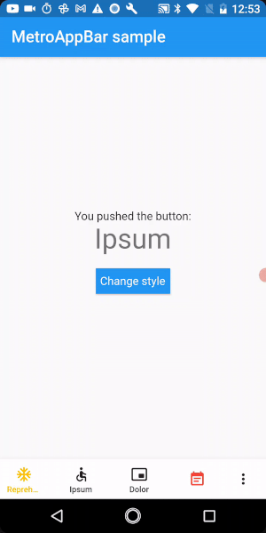

# metro_appbar

Custom app bar with simple and readable design. Customizable buttons and menu style.



## Usage

Add MetroAppBar to your widget tree:
```dart
MetroAppBar(primaryCommands: [
  PrimaryCommand(
      onPressed: () {
        // Add some logic here and to other commands
      },
      icon: Icons.account_balance_rounded,
      text: 'Eiusmod'),
  PrimaryCommand(
      onPressed: () {}, icon: Icons.ac_unit, text: 'Reprehenderit qui'),
  PrimaryCommand(
      icon: Icons.accessible_outlined, onPressed: () {}, text: 'Ipsum')
], secondaryCommands: [
  SecondaryCommand(onPressed: () {}, text: 'Commodo'),
  SecondaryCommand(onPressed: () {}, text: 'Officia'),
]);
```